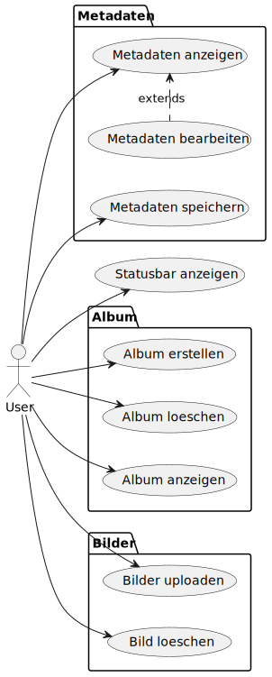

# Use Case Diagram

This use case diagram is based on the UseCase.puml file. It is displayed as svg which is generated by using the plantuml [command line](https://plantuml.com/command-line) tool like this: 
`java -jar "D:\Work\Tools\plantuml.jar" D:\Work\Projects\ImageMetaManager\Documentation\Diagrams\UseCase.puml -o D:\Work\Projects\ImageMetaManager\Documentation\Diagrams -tsvg` 

