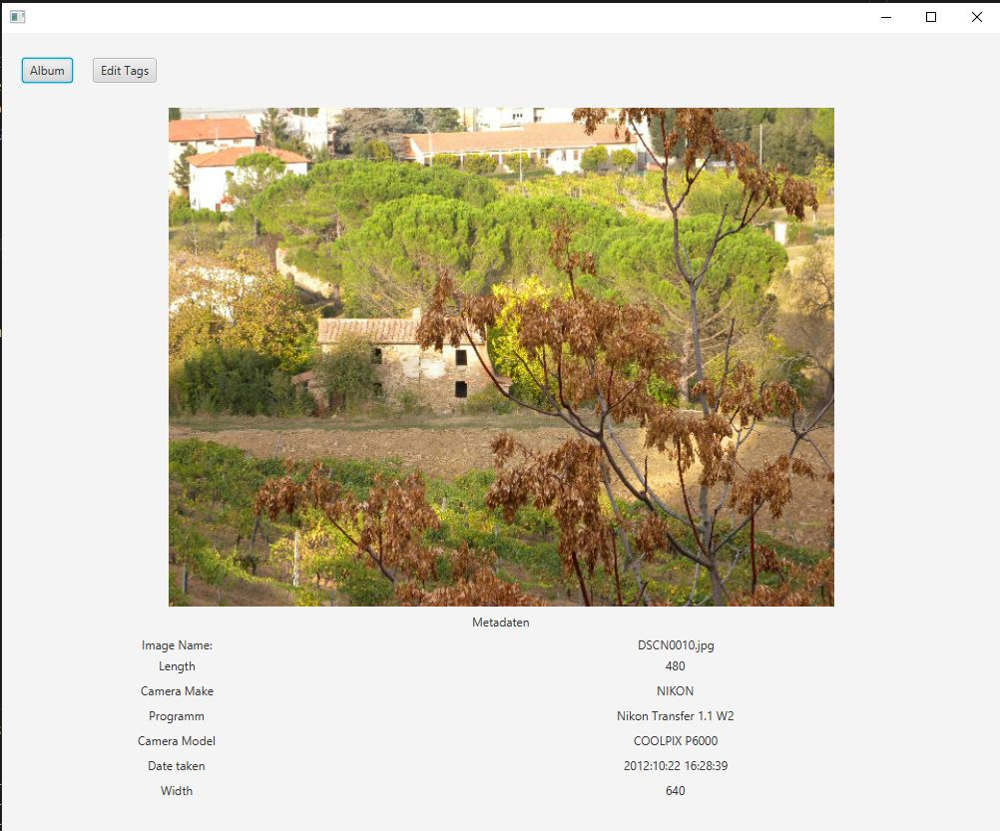

# Dokumentation
Diese Dokumentation erläutert den Image Meta Manager gemäss der Aufgabenstellung für das OOP2-Abschlussprojekt.

Die Applikation Image Meta Manager dient dazu Bilder und deren Metadaten zu verwalten. 

## Benutzung/Bedienung
Nach dem Starten der Applikation werden, falls noch keine Alben vorhanden sind, zwei Beispielalben mit Beispielbildern
erstellt.
Damit die Daten persistieren, werden die Daten in JSON-Dateien unter folgenden Pfad: \<Benutzerprofil>
/image-meta-manager gespeichert.

### Bibliothek-View

Die Startseite ist die Bibliothek wo alle vorhanden Alben ersichtlich sind.  
In der Bibliothek können neue Alben erstellt werden, indem ein Albumtitel und eine -beschreibung vergeben werden. Auch
können vorhanden Alben bearbeitet werden.  
Die Bibliothek kann max. 20 Alben enthalten.
Durch Klicken auf ein Album wechselt man zum Album-View.

### Album-View

In einem Album werden die verschiedenen Bilder die Teile eines Albums sind angezeigt.
Zusätzlich werden die folgenden drei Exif/Tiff-Tags zu jedem Bild aufgelistet:

- DateTimeOriginal: das Datum, an welchem das Bild aufgenommen wurde
- Make: Kamerahersteller und
- Model: Kameramodell (Name oder Nummer)

Durch den `Add`-Button kann man ein neues Bild hinzufügen.
Nach dem Hinzufügen wird das Album-View aktualisiert, um alle Bilder anzuzeigen und der Pfad woher das Bild geladen
wurde, wird persistent gespeichert. Damit wird das nächste Mal, wenn ein Bild hinzugefügt wird automatisch der zuletzt
verwendete Pfad zum Hinzufügen eines Bilds verwendet.

Durch Klicken auf die Bilder kann man diese auswählen und anschliessend über den `Delete`-Button löschen oder über
den `Edit`-Button bearbeiten (wechsel zum Image-View).

Ausgewählte Bilder werden mit einem blauen Rand markiert, damit der Benutzer weiss, welche Bilder zurzeit ausgewählt
sind.

Ein Album kann maximal 6 Bilder beinhalten.

Über den `Library`-Button kommt man zurück in die Bibliothek (Library).

### Image-View
Im Image-View wird das Bild grösser dargestellt und es werden die folgenden Exif/Tiff-Tags angezeigt:
- DateTimeOriginal: das Datum, an welchem das Bild aufgenommen wurde
- Make: Kamerahersteller und
- Model: Kameramodell (Name oder Nummer)
- Software: Name und Nummer des/der Software-Pakt/e das/die verwendet wurden, um das Bild aufzunehmen.
- ExifImageWidth: Die Bildbreite in Pixel.
- ExifImageLength: Die Bildhöhe in Pixel.

Über den `Edit Tags`-Button kann man die Metadaten eines Bilds bearbeiten.
Über den `Album`-Button kommt man zurück in das Album.

## Umsetzung

Nachfolgend ist grob die Reihenfolge der Umsetzung aufgelistet:

- Erstellen der Album- und Image-Klasse und die dazugehörigen Services AlbumService und ImageService.
  Die beiden Services implementieren die Logik, um die jeweilige Klasse zu verwalten und schreiben wichtige Daten in
  JSON, damit diese persistieren.

- Erstellen des SceneController, welcher verwendet wird, um zwischen verschiedenen Scenes/Views hin und herzuwechseln.

- Erstellen des LibraryController, welcher die Bibliothek-View - Anzeige aller vorhanden Alben - implementiert.

- Erstellen des AlbumController, welcher die Album-View - Anzeige alle vorhandenen Bilder eines Albums - implementiert.

- Erstellen des ImageController, welcher die Image-View - detaillierte Anzeige der Metadaten eines Bilds -
  implementiert.

- Erstellen des ExifService, welcher Metadaten aus den Bildern ausliest.

### Unit-Tests

Für jeden Service gibt es eigene dazugehörige Testklasse, welche die Methoden des jeweiligen Services überprüft. Wir
haben dabei eine Code Coverage von min. 80 Prozent für alle Services angestrebt.  
Die Code Coverage sowie Code Smells und Sicherheitsprobleme werden dabei von SonarCloud überprüft.

### Enums

Wir haben keine eigene Enums erstellt, verwenden jedoch Enums von anderen Paketen. Beispielsweise im ExifService um die
relevanten Exif- und Tiff-Tags auszulesen, in den Controllern um den AlertType festzulegen oder im ImageController um
die horizontale Ausrichtung zu definieren.

### Casting

Im SceneController casten wir beispielsweise das Window der momentanen Scene in eine Stage, um anschliessend die Scene
zu
wechseln.  
Auch casten wir in den Controllern diverse JavaFX-Klassen, damit wir die richtigen Typen verwenden, wenn wir die
jeweilige View über den SceneController initialisieren.

### Interfaces

Wir haben ein interface `JsonPeristing` erstellt, welches die Methode `writeDataToJson(List<T> data)` definiert. Das
interface wird von dem AlbumService und ImageService implementiert und so wird sichergestellt das die Daten immer auf
dieselbe Weise in JSON geschrieben werden.
Ausserdem verwenden das Initializable Interface, um den LibraryController zu initialisieren.

### Generics

Wir verwenden im SceneController Generics, um bei einem Szenenwechsel verschiedene Datentypen zu übergeben. Dadurch
können wir in den Album- und Image-Views die richtigen Daten anzeigen.

### Collections

Im ExifService verwenden wir eine HashMap um die Exif- und Tiff-Tags und deren Beschreibung als Key-Value-Pair zu
speichern. Dabei dient das Label/der Tag Name als Key und der EXIFTag als value. Die HashMap erlaubt es uns sicher zu
sein das wir kein Exif Tag doppelt haben. Ausserdem kann so im ImageView der Key direkt als Label verwendet werden.
Wir verwenden auch an verschiedenen Stellen eine ArrayList, um die Daten zu speichern.

### Serialisierung

Im AlbumService, ImageService und AlbumController verwenden wir das FasterXML Jackson Core Paket um die Album- und
Image-Klassen, wie auch der zuletzt verwendete Dateipfad in JSON zu serialisieren. Dadurch werden die oben erwähnten
Daten persistent gespeichert.

### Exceptions

Wir fangen in den Services und Controllern bewusst die Exceptions ab, um allfällige Fehler mit SLF4J zu loggen und somit
Fehlerquellen besser einzugrenzen.

### Maven Build-Prozess

Im Package-Lebenszyklus von Maven erzeugen wir ein ausführbares JAR-File `ImageMetaManager-executable.jar`. Dieses Jar
kann via Doppelklick gestartet werden, sofern die Azul JDK inklusive FX > v 17.0.4 installiert ist.
Ausserdem wird im Maven Prozess auch die Code Coverage durch das jacoco plugin geprüft.